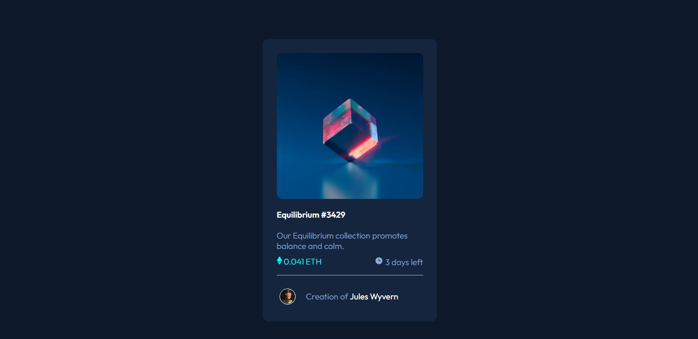

# My Frontend Mentor Preview Card Component 🦾

This is a solution to the [NFT preview card component challenge on Frontend Mentor](https://www.frontendmentor.io/challenges/nft-preview-card-component-SbdUL_w0U). Frontend Mentor challenges help you improve your coding skills by building realistic projects.

## Table of contents

- [Overview](#overview)
  - [The challenge](#the-challenge)
  - [Screenshot](#screenshot)
  - [Links](#links)
- [My process](#my-process)
  - [Built with](#built-with)
  - [What I learned](#what-i-learned)
  - [Continued development](#continued-development)
- [Author](#author)

## Overview

### The challenge

Users should be able to:

- View the optimal layout depending on their device's screen size
- See hover states for interactive elements

### Screenshot

> A screenshot of my solution.

> 

### Links

- Solution URL: [Github](https://github.com/aeorck/femnft)
- Live Site URL: [FEMnft](https://femnft.netlify.app)

## My process

### Built with

- Semantic HTML5 markup
- CSS custom properties
- SASS
- Flexbox
- CSS Grid
- Mobile-first workflow

### What I learned

I have always been confused about the usage of positioning a HTML block with the use of

```html
<span class="codesnip"> Position:absolute</span>
```

and

```html
<span class="codesnip"> position:relative </span>
```

, but from taking my time to learn its relativity to designing a hitch-free static website through concurrent testing, I was finally able to get the hang of it.

```css
.codesnip {
  color: papayawhip;
  width: fit-content;
  font-family: consolas;
}
```

### Continued development

My intention is to continue developing myself in the aspect of a responsive and beautiful web design, especially in the area of HTML syntax and the use of SASS/CSS to improve my design before transitioning into Javascript.

### Useful resources

- [How to use Position in CSS](https://www.freecodecamp.org/news/css-positioning-position-absolute-and-relative/) - This helped me in understanding the concept attached positioning in CSS, to using **relative** and **absolute** positioning. I really liked this pattern and will use it going forward.

## Author

- Frontend Mentor - [@aeorck](https://www.frontendmentor.io/profile/aeorck)
- Twitter - [@datphoenixx](https://www.twitter.com/datphoenixx)

## Acknowledgments

Me, myself and I. I think I owe myself a delicious dinner 😋😋
